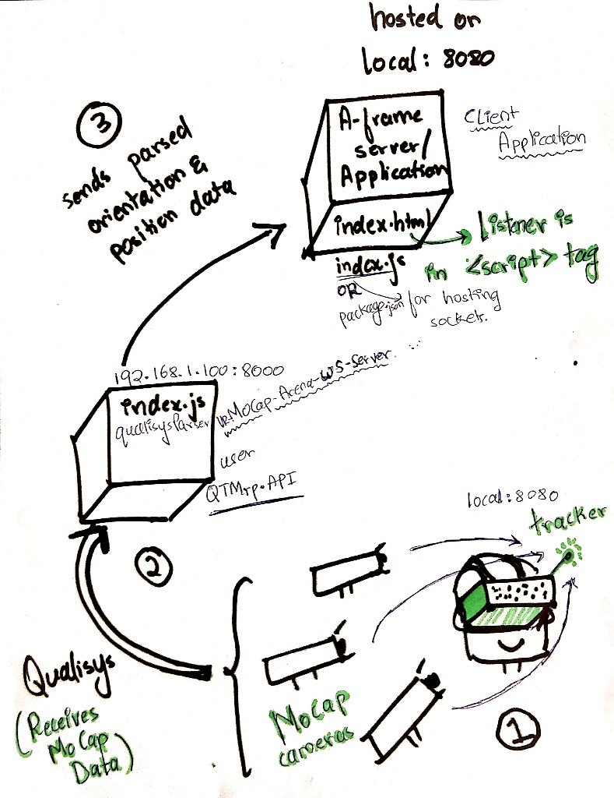
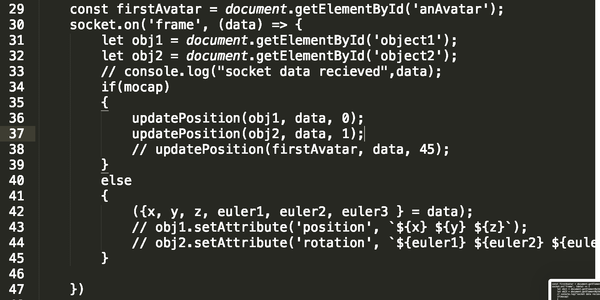
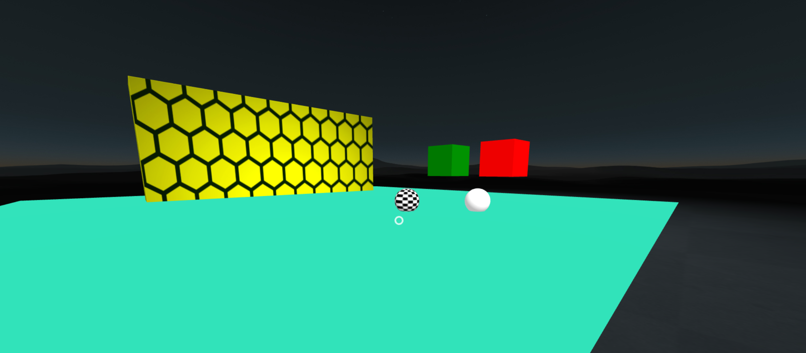
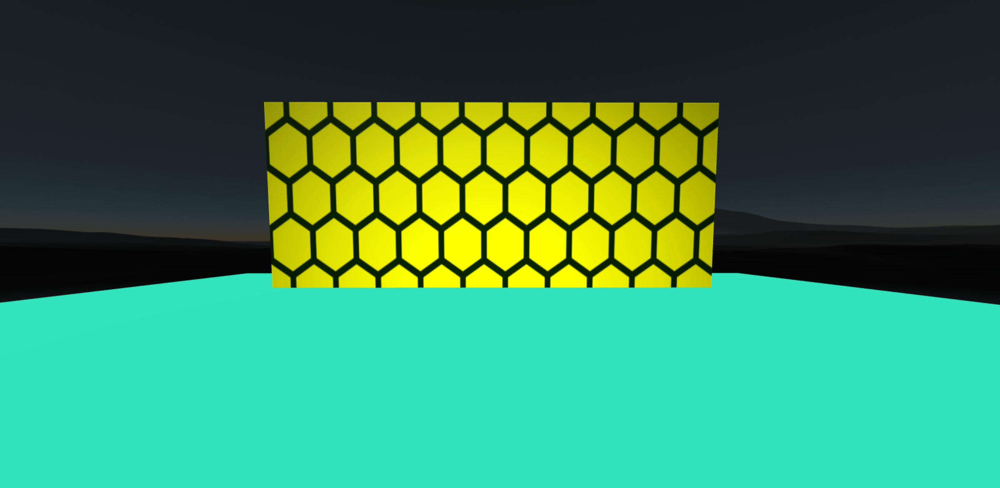

# Aframe-Mocap-Server-Simulator
This is a node.js server simulating the mocap data + A-Frame application that aims to work with the MoCap arena!

Working overview!

# Requirements

Install Node.js® and NPM (Node Package Manager).

For mac users, the easiest way is to use install using homebrew:-

    $ brew install node

For Ubuntu users, simply use apt.

    $ sudo apt install nodejs

Build/update your A-Frame application

    $ npm install

# Pre-run checklist

Open the QTM application and start the live streaming, make sure that:-

	1.	The cameras are calibrated.
	2.	The firewall is deactivated for the default port.
	3.	The object orientation is set according to your needs.

Please go to the objects list and note the object IDs (starting from 0) of the two objects that you wish to use with the application. Now, open the main.js file in the scripts folder and hard-code the object ID in line 36 and 37 as seen below. The default object IDs are 0 and 1.

If you are not running this application on the mocap server, you need to set the following variables to 'false':-

	1. scripts/main.js -> line 25
	2. simulator.js -> line 11

You can set the application port to your desired address by changing the value at scripts/main.js -> line 21

Now you are all set to use the application!

# Run the application:

    $ npm run start

    Application is served at

    	1. Mocap enabled: http://192.168.1.100
    	2. Mocap disabled: http://127.0.0.1

# About the application:-

This is a two-player setting. Each player chooses one of the two balls, plain white or checkered, by clicking on the green or the red block respectively. The player is assigned to that the ball selected and their camera is reset to that of the ball selected as seen below.

# Post implementation notes: Multiplayer:-

The optimal approach to assigning players to the objects in the application is by having them select their player-ID. This will also allow them to reconnect to the last instance in case of a browser crash or device change.

When the user hits the application IP address, they have the default scene camera. Once they select their object and click, their camera resets to that of the object.

After extracting the right object from the MoCap stream, we had to create the right camera components and pass them with this data. This is done by fetching the camera components from the index.html file and making the updates in the scripts. As soon as the user selects their object, we create a camera element and attach it to the object's parent entity. On the other hand, the function 'updatePosition' does the task of updating the position and the orientation of the object.

the updatePosition function takes in a single raw MoCap data frame, extracts the right object values from the entire object list and publishes it to the high-level A-frame camera component.

This function is easily scalable and can be used for a large number of players as well.

# Additional notes:-

1. We fetch the data from mocap at the address 'http://127.0.0.1:8080'. This can be changed by going to scripts/main.js -> line 22. However, there is no need to change this.
2. If you want to see only one object, checkout to the branch called "rotation_fix"
3. Since the scale of the MoCap studio is atleast 50 times as compared to the scale of the application, we have to normalize the position values. This has been done in the function 'updatePosition' in the scripts/main.js file.

# Future work:-

The application correctly updates the position of the objects based on the data fetched from MoCap. However, the rotation is still flawed - the camera is extra or under-responsive to the actual headset rotations. This might be happening due to interference from the phone's IMU OR due to some error arising from setting MoCap's rotation data to the object's rotation in A-frame.

The right way to fix this is to disable the IMU by going into A-frame/Three.js modules that are locally built. If the problem persists, that means the issue is happening in parsing MoCap's rotation data to the object's rotation in A-frame.